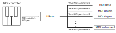

# HRave: Emulates the automation features of an 80's home organ

This project aims to imitate some of the cool features found in 80's home
organs, such as the Drudel organ. These features typically include things like
built-in rhythms to play along to and automatic accompaniment based on the chord
that is played in the left hand.

This project allows such features to be used with MIDI software instruments on
a PC. It does so by listening for MIDI inputs from a MIDI controller, modifying
those messages, and forwarding the modified messages to the MIDI software of
your choice. It hence requires a virtual MIDI port to be present on the computer
it is being run on, to which it can write MIDI messages and which your MIDI
software instruments can listen to (more on this below).

## Features

The following features are currently supported:

### Beats

Beats are percussive rhythms that the player can play along to.

### Automatic chord rhythms

HRave divides the MIDI controller into halves: the upper halves control the
melody, and the lower half controls chords. Holding a chord in the lower half
will cause that cord to be played in a rhythm that fits with the current Beat
being played.

### Automatic Bass lines

When a chord is held in the lower half of the midi controller, a bass line will
automatically be played which fits the current Beat being played. The exact
notes that are played in the bass are automatically determined by the chord
which is being held.

### Chord melody

When a chord is held in the lower half of the midi controller, that chord can be
"overlayed" on the melody being played in the upper half. That is, when the
player plays a single note in the right hand, the produced sound will be the
chord being held in the left, but inverted such that the melody note is on top,
and transposed to be as close below the melody note as possible. This gives a
"fat" sound without the need for the player to be skilled.

## Requirements

To build this, you need
[Stack](https://docs.haskellstack.org/en/stable/README/).

To use the software, you need a virtual MIDI device that HRave can write midi
messages to, and that the software instrument can listen to. Below are
instructions for how to set this up on different operating systems

### Linux:

On linux, we use Alsa's Midi Through ports. To verify that you have a Midi
Through port, run `aplaymidi -l` and make sure a client named `Midi Through` is
in the list. If not, you need to enable the `snd-seq-dummy` kernel module. Use a
search engine of your choice to figure out how to do this on your distro.

### macOS:

[This page](https://feelyoursound.com/setup-midi-os-x/) describes how to set up
a virtual midi connection on macOS

### Windows:

TODO

## Usage

To compile:

```
stack build
```

To run:
```
stack run
```

Or run:

```
stack install
```

Which should put the executable in a location that is in your `$PATH`. Then you
can simply run `hrave` and the program will start.

When you run the program, it will ask you for a MIDI input device and a MIDI
outuput device. For the input device, select your MIDI controller. For the
output device, select a virtual MIDI port (as described above). In your software
instrument, you need to select the same virtual MIDI port as your input.

This software listens for MIDI messages on channel 0 of the input device, and
outputs messages on multiple channels on the virtual MIDI port. Each output
channel is used for one part of the music, e.g. percussion, bass, chords, melody
and chord melody. Hence, you need to configure your software instrument so that
each channel is routed to an instrument appropriate for that part. For instance,
the bass channel should be routed to a bass instrument, the drum channel to a
drum instrument, etc. The diagram below should make this more clear:



### GM drums

The drum channel uses the drum sounds of General MIDI, so make sure to use a
drum kit that supports this.

## Tech

This project is built using Haskell and [reactive-banana](https://hackage.haskell.org/package/reactive-banana)
, a Haskell library for functional reactive programming.
